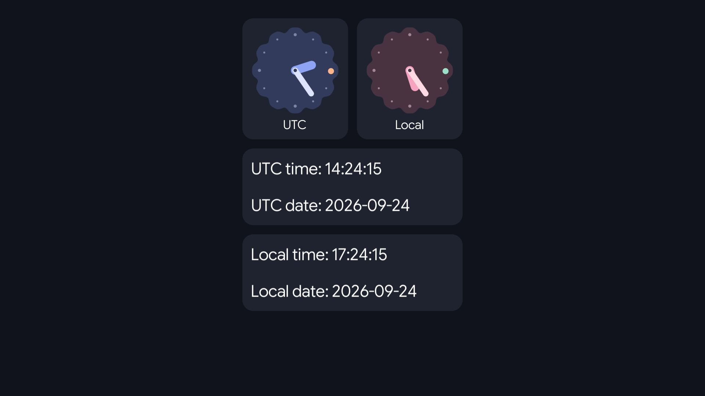
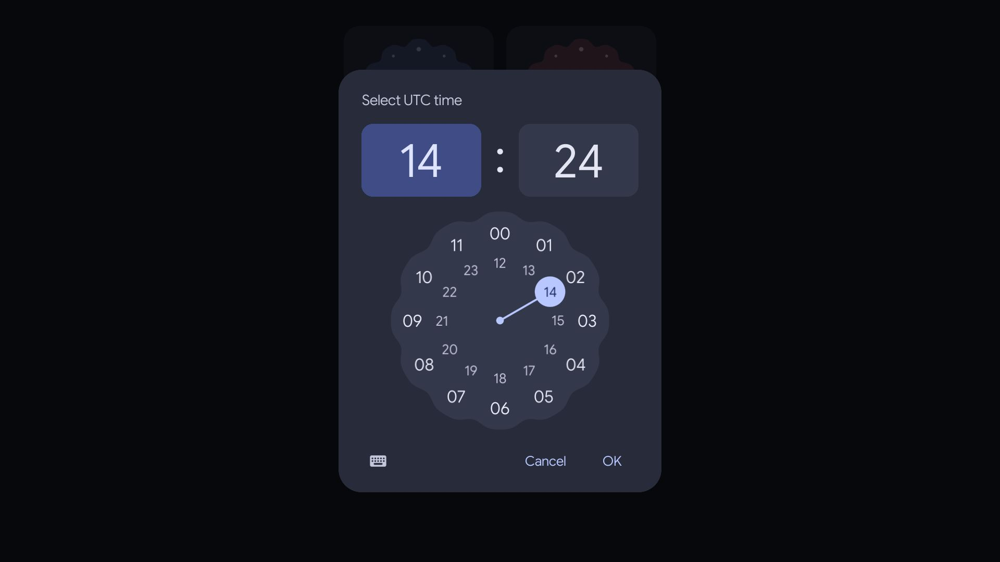
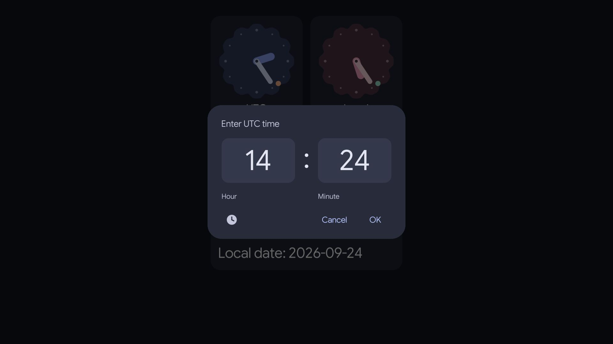

### About WorldClockViewer

A simple WebGL app that displays current UTC and local date and time.

You can edit time by clicking on one of the analogue clocks and selecting the time that you want to set. This will override both UTC and Local time so next time you open the app it will be set the way you set it (unless you reset the custom setting):

You can also set time by typing it via keyboard (the same principle applies of how time is being set, saved and reset as with analogue time setter):

